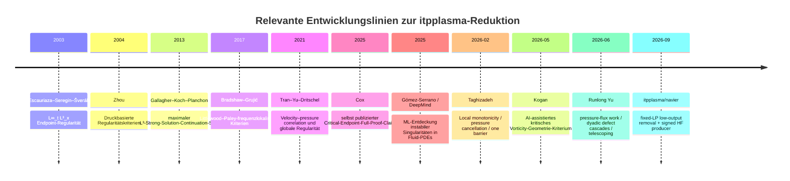
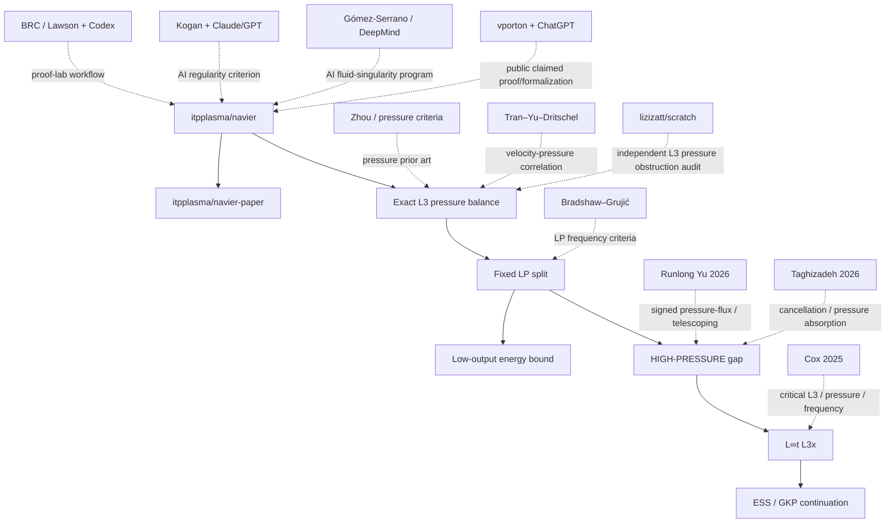

# Prior-art and novelty audit supplied by the user (2026-09-05)

Provenance: this text was supplied by the user on 2026-09-05 (evening) as an
external literature and novelty audit of `itpplasma/navier` and
`itpplasma/navier-paper`, produced outside this repository. It is a research
lead, not a verified source record. The inline markers of the form
`citeturn…` and `fileciteturn…` are citation artifacts of the tool that
produced the text; they are preserved verbatim and carry no evidential
weight here. Every claim about an external source below must be checked
against the primary text before it is cited in the manuscript or the
literature dossier; the source-check record is
`cp02-prior-art-related-work.md`. Per `PLAN.md` ("External opinions and
prior-art audit"), the controller decides which comparisons survive.

Note added by the controller: the audit refers to the manuscript state
before the CP02 assembly (pressure-route wording, GKP as the endpoint
source). The assembled manuscript at `navier-paper` `909ff21` proves the
continuation theorem through Escauriaza–Seregin–Šverák Theorem 1.3 and
contains the cubic gradient quotient route; the audit's comparison matrix
does not yet cover the quotient functional (see `cp01-prior-art-quotient.md`).
Its third research priority (an explicit divergence-free profile with
nonzero pressure work) was completed and audited in wave HF02
(`hf02-r3-profile.md`, `hf02-review-profile.md`).

---

# Neuheits- und Literaturaudit des Ansatzes `itpplasma/navier` + `itpplasma/navier-paper` zur dreidimensionalen Navier–Stokes-Regularität

## Executive Summary

**Stichtag der Recherche: 5. September 2026, Europe/Vienna.** Das Clay Mathematics Institute führt das dreidimensionale Navier–Stokes-Problem weiterhin als **„Unsolved“**. citeturn22search0

Das wichtigste Ergebnis dieses Audits ist:

> **KRITISCHER NOVELTY-CHECK: Ich habe keinen publizierten Artikel, arXiv-Preprint oder öffentlich indexierten GitHub-Ansatz gefunden, der dieselbe Reduktion mit derselben Quantorenstruktur wie `itpplasma/navier` formuliert oder beweist.**

Mit „dieselbe Reduktion“ meine ich ausdrücklich die **gemeinsame** Struktur

\[
\frac13\frac d{dt}\|u(t)\|_3^3+\nu D_3(t)
=
P_3(t),
\qquad
P_3(t)=\int_{\mathbb R^3} p\,u\cdot\nabla |u|\,dx,
\]

gefolgt von einem **festen, aus den Eingaben gewählten Littlewood–Paley-Drucksplit**

\[
P_3=L_J+H_J,
\]

einem bereits bewiesenen **energie-only**-Estimate des gesamten low-output-Anteils

\[
\left|\int_0^\tau L_J(t)\,dt\right|
\le
C2^{3J}\|u_0\|_2^4
\left(\frac{H}{2\nu}\right)^{1/2},
\]

und der Isolierung genau des verbleibenden signierten high-output-Producers

\[
\boxed{
\int_0^\tau H_J(t)\,dt
\le
\theta\nu\int_0^\tau D_3(t)\,dt+
A_{\rm high}(\nu,u_0,H,J)
}
\tag{HF}
\]

mit

\[
\forall(\nu,u_0,H)\ \exists(J,A_{\rm high})\
\forall\,0<\tau<\min\{H,T_*\},
\]

wobei dieselben \(J,A_{\rm high}\) für das gesamte Intervall funktionieren und die Zeugen nicht über den unbekannten kritischen Supremumswert oder eine andere Continuation-Norm definiert werden dürfen. Genau diese Struktur ist im Repository formuliert und durch die internen Audits als der **erste tatsächlich offene Übergang** identifiziert. fileciteturn12file0L1-L6 fileciteturn14file0L1-L6

Eine zusätzliche öffentliche GitHub-Code-Suche nach der charakteristischen Kombination `D_3(t)`, `pressure`, `L^3` lieferte als Treffer für das konkrete \(D_3/P_3/H_J\)-Schema ausschließlich Dateien aus `itpplasma/navier` und `itpplasma/navier-paper`; insbesondere erschien kein zweites öffentliches Repository mit derselben HF-Formel. Das ist **starke Evidenz für eine eigenständige Formulierung**, aber natürlich kein mathematischer Beweis der weltweiten Prioritätsfreiheit. fileciteturn36file0L1-L13 fileciteturn36file1L15-L30 fileciteturn36file2L31-L40

**Die einzelnen Ingredienzien sind dagegen nicht neu.** Druckbasierte Regularitätskriterien reichen mindestens zu Beirão da Veiga, Berselli–Galdi, Chae–Lee und Zhou zurück; Zhou publizierte 2004 in *Mathematische Annalen* Regularitätsbedingungen allein in Termen des Drucks bzw. Druckgradienten. citeturn22search1 Die kritische \(L^\infty_tL^3_x\)-Fortsetzung ist die klassische Escauriaza–Seregin–Šverák-Theorie und wurde von Gallagher–Koch–Planchon in einer maximalen Strong-Solution-Form nochmals bewiesen. citeturn22search2 Littlewood–Paley-frequenzlokalisierte Regularitätskriterien existieren etwa bei Bradshaw–Grujić. citeturn20search0turn20search8 Druck–Geschwindigkeits-Korrelationen wurden von Tran–Yu–Dritschel direkt mit der Frage globaler Regularität verbunden. citeturn21search0turn21search16

Der **engste mathematische Konkurrent im Jahr 2026** ist meiner Einschätzung nach nicht ein klassisches pressure criterion, sondern die aktuelle Serie von **Runlong Yu**. Besonders `arXiv:2606.25322` beweist für eine lokale CKN/coarse-grained Formulierung eine **signierte pressure-flux work decomposition** und sogar eine **gewichtete Teleskopierungsungleichung** entlang einer festen Skalenfolge. citeturn19academia40 Sein begleitender Audit sagt jedoch ausdrücklich, dass diese Obstruction Calculus bisher **keine coercive estimate** liefert, die den verbleibenden kritischen Mechanismus ausschließt. citeturn19academia42 Dies ist der wichtigste Prior-Art-Komplex, den ein `navier-paper`-Manuskript ausführlich diskutieren sollte.

Der **engste ältere physikalisch-mathematische Vorläufer** ist Tran–Yu–Dritschel 2021: Dort wird beim Wachstum von \(L^q\)-Geschwindigkeitsnormen gerade der Druckterm untersucht, und die Autoren formulieren Regularitätskriterien über velocity–pressure correlation. citeturn21search4turn21search16 Er enthält aber weder den festen LP-pressure-output-Split noch die low-output-Elimination noch (HF).

Der **größte narrative Prior-Art-Risikofaktor** ist der selbst veröffentlichte Preprint von S. Taghizadeh, *A Local Monotonicity Reduction … to a Single Remaining Barrier* von Februar 2026, DOI `10.5281/zenodo.18468477`. Er benutzt bereits Vokabular wie cancellation, pressure absorption und „single remaining barrier“, arbeitet jedoch lokal/CKN-artig und nicht mit der globalen \(L^3\)-HF-Struktur von `itpplasma`. citeturn22search3

Joseph Thomas Cox' November-2025-Manuskript ist wegen der Kombination **critical \(L^3\) + pressure-aware energy + frequency localization + high-frequency tails** ebenfalls wichtig. Es behauptet sogar vollständige Regularität, ist jedoch ein selbst hochgeladenes Manuskript auf ResearchGate und hat sich nicht als akzeptierte Lösung durchgesetzt; der Clay-Status bleibt „Unsolved“. citeturn21search2turn22search0 Auch dort habe ich den spezifischen fixed-\(J\) low/high pressure-output estimate von `itpplasma` nicht gefunden.

Meine Gesamtbewertung der **behauptbaren Neuheit** lautet daher:

| Aspekt | Neuheitsbewertung |
|---|---|
| \(L^3\)-Endpoint als Zielnorm | **nicht neu** |
| Test mit \(|u|u\), Druckterm im \(L^3\)-Budget | **im Grundmechanismus nicht als neu beanspruchen** |
| Pressure-based regularity | **nicht neu** |
| LP/frequency localized regularity | **nicht neu** |
| „nur hohe Frequenzen können gefährlich sein“ | **nicht neu** |
| signierte pressure/flux cancellation allgemein | **nicht neu** |
| Low-output-Druckarbeit durch \(L^2\)-Energie bei festem \(J\) vollständig entfernen | **in genau dieser Form kein Vorläufer gefunden; wahrscheinlich eigenständige Lemma-Formulierung, aber elementar** |
| ein *einziger aggregierter signierter* high-pressure tail statt \(\ell^1\)-Summation absoluter Shells | **deutlich spezieller; partielle konzeptuelle Überlappung mit Yu 2026** |
| Quantoren \(\forall(\nu,u_0,H)\exists(J,A)\forall\tau\) mit endpoint-uniformen, nichtzirkulären Zeugen | **sehr charakteristisch; kein identischer Vorläufer gefunden** |
| komplette Kette `HF → PA → finite-horizon L∞L3 → GKP/ESS → Clay A` | **kein identischer Vorläufer gefunden** |
| tatsächlicher Beweis von HF | **nicht vorhanden; dies ist weiterhin das Millennium-scale gap** |

Die Konsequenz für die Publikationsstrategie ist wichtig: **Das gegenwärtige Manuskript sollte seine Neuheit nicht als „neue pressure method“ oder „neue frequency-localized regularity theory“ verkaufen.** Die glaubwürdigste Neuheitsbehauptung ist wesentlich enger:

> *Eine explizite Reduktion des globalen kritischen \(L^3\)-Problems auf einen einzigen aggregierten, signierten, zeitintegrierten high-output pressure-flux estimate, nachdem der gesamte low-output-Anteil mit einem input-only Energieestimate eliminiert wurde, einschließlich vollständiger endpoint-uniformer Quantoren.*

Das ist nach dieser Recherche plausibel originell. Der wirkliche Top-Journal-Sprung entsteht aber erst, wenn aus dieser Architektur **ein neuer unbedingter Satz** hervorgeht — idealerweise zunächst die Ausschließung einer großen Blow-up-Klasse und letztlich (HF) für beliebige Clay-Daten.

## Repositorien und exakter mathematischer Fingerabdruck

Ich habe die Repository-Bäume, das Manuskript, Proof Map, Forschungsnotizen, Literaturdossiers, Audits und die ausführbaren Hilfsprogramme inspiziert. `navier` enthält neben README/Plan insbesondere `docs/proof-graph.yaml`, `docs/proof.md`, vier Literaturdossiers, die Forschungsnotizen `architecture.md`, `frequency.md`, `compactness.md`, `enstrophy.md` sowie vier unabhängige Review-Dateien, außerdem `research/verify.py` und `tools/generate_map.py`. fileciteturn3file0L1-L10 `navier-paper` enthält das eigentliche `main.tex`, `proof_map.tex`, `references.bib`, Build-Dateien und Agenteninstruktionen. fileciteturn4file0L1-L12

Zum Recherchezeitpunkt waren in beiden Repositories **keine GitHub Issues und keine Pull Requests** vorhanden. fileciteturn38file0L1-L12 fileciteturn39file0L1-L12 fileciteturn40file0L1-L12 fileciteturn41file0L1-L12

Die Python-Datei `research/verify.py` ist ausdrücklich nur ein **Dokument-/Graph-Integritätschecker**, kein mathematischer Verifier: Sie prüft unter anderem eindeutige Claim-IDs, Azyklizität, vorhandene Evidenzpfade und Manuskriptlabels und erzwingt, dass `NS-R3` weiterhin als `gap` markiert bleibt. fileciteturn17file0L1-L6 `tools/generate_map.py` rendert lediglich den autoritativen Claim-Graph in ein TikZ/LaTeX-Supplement. fileciteturn18file0L1-L6 Diese Trennung ist wissenschaftlich sinnvoll, weil weder Build-Erfolg noch Graph-Konsistenz als mathematische Verifikation ausgegeben werden.

Der mathematische Kern des Manuskripts ist der exakte kritische Test. Für die maximale klassische Lösung setzt es

\[
X(t)=\|u(t)\|_3^3
\]

und

\[
D_3(t)=
\int_{\mathbb R^3}
\left(
|u||\nabla u|^2+
|u||\nabla|u||^2
\right)\,dx.
\]

Nach Regularisierung von \(|u|\) und Cutoff-Limit erhält das Manuskript

\[
\boxed{
\frac13X'(t)+\nu D_3(t)=P_3(t)
}
\]

mit

\[
\boxed{
P_3(t)=
\int_{\mathbb R^3}
p\,u\cdot\nabla |u|\,dx.
}
\]

Der pressure audit überprüft Vorzeichen, Nullstellenregularisierung, Integrabilität der Cutoff-Terme, Riesz-Drucknormalisierung und die Viskositätsnormalisierung für die spätere Endpoint-Anwendung. fileciteturn21file0L1-L6

Für eine reale, gerade, selbstadjungierte Littlewood–Paley-Zerlegung wird

\[
p=p_{\le J}+p_{>J}
\]

gesetzt und damit

\[
P_3=L_J+H_J,
\]

wobei

\[
L_J(t)
=
\int p_{\le J}\,u\cdot\nabla |u|\,dx,
\qquad
H_J(t)
=
\int p_{>J}\,u\cdot\nabla |u|\,dx.
\]

Die wichtige konzeptionelle Entscheidung ist, \(H_J\) **als eine einzige signierte Summe** stehen zu lassen, statt

\[
\sum_{j>J}
\left|
\int \Delta_jp\,u\cdot\nabla|u|
\right|
\]

abzuschätzen. Die zweite Form würde gerade die gesuchte Inter-Shell-Cancellation zerstören und zusätzliche Besov-\(\ell^1\)-Summierbarkeit verlangen. fileciteturn12file0L1-L6 fileciteturn20file0L1-L6

Für den low-output-Anteil ist tatsächlich ein unbedingtes Lemma vorhanden. Aus dem frequenzabgeschnittenen Riesz-Kernel folgt

\[
\|p_{\le J}(t)\|_\infty
\le
C2^{3J}\|u(t)\otimes u(t)\|_1
\le
C2^{3J}\|u_0\|_2^2,
\]

also

\[
|L_J(t)|
\le
C2^{3J}
\|u_0\|_2^3
\|\nabla u(t)\|_2,
\]

und Energie plus Cauchy–Schwarz liefern für jedes

\[
0<\tau<\min\{H,T_*\}
\]

die endpoint-uniforme Schranke

\[
\boxed{
\left|
\int_0^\tau L_J(t)\,dt
\right|
\le
C2^{3J}
\|u_0\|_2^4
\left(\frac{H}{2\nu}\right)^{1/2}
=:A_{\rm low}.
}
\]

Der unabhängige Frequenz-Audit hat die Kernelrechnung, die Potenzen und die Zeitintegration explizit nachgerechnet. fileciteturn20file0L1-L6

Damit ist das aktuelle offene Lemma außergewöhnlich präzise:

\[
\boxed{
\exists\theta\in[0,1)
\quad
\forall \nu>0,\ u_0\in\mathcal S_\sigma,\ H<\infty
\quad
\exists J\in\mathbb Z,\ A_{\rm high}<\infty
}
\]

so dass

\[
\boxed{
\forall\,0<\tau<\min\{H,T_*\}:\qquad
\int_0^\tau H_J(t)\,dt
\le
\theta\nu
\int_0^\tau D_3(t)\,dt
+
A_{\rm high}(\nu,u_0,H,J).
}
\]

Insbesondere stehen \(J,A_{\rm high}\) **vor** dem \(\forall\tau\); dieselben Zeugen müssen bis an einen möglichen maximalen Endpunkt funktionieren. fileciteturn10file0L1-L2 fileciteturn14file0L1-L6

Die interne Auditierung hat dabei eine wichtige logische Feinheit richtiggestellt. Es ist nicht sinnvoll, „\(A\) hängt von \(u_0\), aber nicht von \(T_*\) ab“ rein extensional zu lesen, weil die deterministische maximale Lösung und damit \(T_*\) natürlich durch \(u_0\) bestimmt werden. Der belastbare Inhalt ist die **Quantorenordnung und Nichtzirkularität des Beweises**: ein endliches \(A\) muss uniform für alle \(\tau\) existieren, ohne seine Endlichkeit über \(\sup_{t<T_*}\|u(t)\|_3\), einen äquivalenten Fortsetzungsnormwert oder den gerade zu kontrollierenden Drucksupremumswert zu begründen. fileciteturn14file0L1-L6

Aus (HF) und dem low-output-Lemma folgt

\[
\|u(\tau)\|_3^3
+
3(1-\theta)\nu\int_0^\tau D_3(t)\,dt
\le
\|u_0\|_3^3+
3(A_{\rm low}+A_{\rm high}).
\]

Für die bloße Endpoint-Regularität genügt sogar \(\theta=1\); \(\theta<1\) ist stärker, weil es zusätzlich einen echten positiven \(D_3\)-Budget liefert. Dies wird sowohl im Manuskript als auch in den Audits korrekt unterschieden. fileciteturn10file0L1-L2 fileciteturn21file0L1-L6

Der letzte Schritt ist dann Standard: Gallagher–Koch–Planchon beweisen für \(u_0\in L^3(\mathbb R^3)\), dass eine maximale starke Lösung mit

\[
\sup_{t<T_*}\|u(t)\|_3<\infty
\]

nicht bei endlichem \(T_*\) singular werden kann; dies reproduziert die Escauriaza–Seregin–Šverák-Endpoint-Theorie. citeturn22search2 Das Manuskript verwendet genau diesen Schluss und keine Behauptung, dass ESS die kritische Schranke selbst erzeugen würde. fileciteturn14file0L1-L6

Die interne Proof Map ist daher inhaltlich korrekt beschriftet:

\[
\mathrm{ENERGY}
\to
\mathrm{LOW\mbox{-}PRESSURE},
\]

\[
\mathrm{LOW\mbox{-}PRESSURE}
+
\boxed{\mathrm{HIGH\mbox{-}PRESSURE}}
\to
\mathrm{ABSORPTION}
\to
\mathrm{CRITICAL}
\to
\mathrm{ESS/GKP}
\to
\mathrm{CONDITIONAL\ CLAY}.
\]

`HIGH-PRESSURE`, `ABSORPTION`, `CRITICAL` und das terminale `NS-R3` bleiben GAP-Nodes. fileciteturn11file0L1-L2 Der finale Integration-Audit gibt deshalb ausdrücklich **PASS** für die konditionale Kette und **FAIL WITH SCOPE** für eine unbedingte Clay-Behauptung; erster unsupported bridge bleibt HIGH-PRESSURE. fileciteturn14file0L1-L6

## Literatur- und Prior-Art-Landschaft

**Druckbasierte Regularitätskriterien.** Dieser Bereich ist alt und umfangreich. Zhou 2004 erhält in *Mathematische Annalen* hinreichende Regularitätsbedingungen in Termen des Drucks bzw. Druckgradienten; die Bibliographie dieses Artikels verweist bereits auf Beirão da Veiga, Berselli–Galdi und Chae–Lee als frühere pressure criteria. citeturn22search1 Spätere Arbeiten behandeln unter anderem Druck in Lorentz-Räumen und gemischte pressure–velocity conditions; Beirão da Veiga–Yang 2022 ist ein Beispiel für diese Linie. citeturn22search5 Ein Manuskript sollte deshalb **niemals „pressure-based regularity criterion“ als Neuheitsclaim** verwenden.

Diese Kriterien unterscheiden sich aber strukturell von `itpplasma`: typischerweise nimmt man eine zusätzliche Integrabilitäts- oder Kleinheitsbedingung für \(p\), \(\nabla p\) oder eine Kombination mit \(u\) an. Die `itpplasma`-Fragestellung lautet stattdessen, ob die **tatsächliche signierte Druckarbeit im exakten kritischen \(L^3\)-Budget** entlang jeder Lösung durch Dissipation plus einen input-only Rest kontrollierbar ist. Das ist eine engere dynamische Frage.

Besonders relevant ist Tran–Yu–Dritschel, *Velocity–pressure correlation in Navier–Stokes flows and the problem of global regularity*, *Journal of Fluid Mechanics* 911 (2021), A18. Die Autoren untersuchen explizit, wie die pressure–velocity correlation Wachstum hoher Geschwindigkeitsnormen moderiert, zerlegen den Raum in high- und low-velocity regions und diskutieren daraus Regularitätsbedingungen. citeturn21search4turn21search16 Dies ist ein echter konzeptioneller Vorläufer für die Idee „behandle den Druck nicht als beliebige absolute Nichtlinearität, sondern bewahre seine strukturierte Korrelation“. Der Artikel benutzt aber keine feste LP-pressure-output-Zerlegung und beweist nicht das `itpplasma`-HF.

**Frequency-localized criteria.** Bradshaw–Grujić beweisen zwei LP-frequenzlokalisierte Regularitätskriterien und zeigen insbesondere, dass man die Regularitätsfrage auf ein relevantes Frequenzfenster beschränken kann, dessen untere Grenze gegen eine anfängliche Singularzeit nach oben wandert. citeturn20search0turn20search8 Das bedeutet: Aussagen wie „nur gewisse hohe Frequenzen sind für die Singularität relevant“ oder „die kritische Information lässt sich auf ein Frequenzfenster reduzieren“ besitzen klare Prior Art. Ihr Objekt ist jedoch die frequenzlokalisierte Geschwindigkeit/Wirbelstärke, nicht der signierte high-output-Anteil des \(L^3\)-Druckbudgets.

**Endpoint-\(L^3\).** Die Schlüsseltheorie ist ESS und GKP. GKP formulieren explizit: starke Lösungen, die in \(L^3(\mathbb R^3)\) bis zur maximalen Zeit beschränkt bleiben, können dort nicht singular werden. citeturn22search2 Daher ist die `itpplasma`-Zielgröße exakt richtig gewählt, aber dieser Endpunkt selbst ist etablierte Literatur und kein Neuheitsbestandteil. Das Manuskript zitiert ESS, GKP, Kato, Tao und die Clay-Formulierung bereits korrekt als Basisschicht. fileciteturn19file0L1-L6

**Signierte Flux- und Teleskopierungsmechanismen.** Hier liegt der relevanteste neue Prior-Art-Komplex. Runlong Yu beweist im Juni 2026 in `arXiv:2606.25322`, *Coarse-Grained Resolution and Pressure-Flux Work Depletion for Navier-Stokes CKN Badness*, eine coarse-grained Zerlegung der lokalen CKN-Größen und für

\[
G^\ell=\Pi^\ell+\operatorname{div}(P^\ell U^\ell)
\]

eine **exact fixed-chain depletion theorem**. Für bestimmte aktive Testfamilien entsteht eine gewichtete Teleskopierungsungleichung, bei der positive combined work und resolved dissipation durch Anfangsenergie, Leakage und negative Arbeit/Backscatter bezahlt werden. citeturn19academia40 Das ist der stärkste direkte Prior-Art-Treffer für die Idee

\[
\text{signierter Flux}
\quad+\quad
\text{Skalenzerlegung}
\quad+\quad
\text{Teleskopierung}
\quad+\quad
\text{Dissipation}.
\]

Aber Yu arbeitet **lokal, coarse-grained und CKN-orientiert**. Sein \(G^\ell\) ist nicht

\[
H_J=\int p_{>J}\,u\cdot\nabla|u|\,dx,
\]

und sein Satz produziert nicht

\[
\forall(\nu,u_0,H)\exists(J,A)\forall\tau
\]

eine globale finite-horizon \(L^\infty_tL^3_x\)-Schranke.

Das ist kein interpretativer Grenzfall: Yu selbst schreibt in seinem parallel veröffentlichten *Structural Audit*, dass die vorhandenen pressure–flux identities und defect decompositions bislang **keine coercive estimate liefern**, die die verbleibende Obstruktion ausschließt; als nächsten notwendigen Schritt identifiziert er einen filtered stretching–diffusion estimate. citeturn19academia42 Seine *Invisible Defect Cascades* formulieren ebenfalls nur eine **conditional scale-critical defect-cascade reduction** für lokale CKN-Regularität. citeturn19academia41 Die Parallele ist daher sehr eng auf Mechanismusebene, aber nicht theorem-identisch.

**Type-I und kritische Konzentration.** Die Literatur zu kritischen bzw. Type-I-kontrollierten Lösungen zeigt, dass erhebliche Information unter solchen Zusatzannahmen gewonnen werden kann, ohne das allgemeine Problem zu lösen. Das `navier`-Literaturdossier ordnet etwa Barker–Prange, Tao und neuere quantitative kritische Arbeiten in genau dieser Rolle ein. fileciteturn15file0L1-L6 Ein Resultat, das aus einem natürlichen allgemeinen Type-I-Regime mittels (HF) tatsächlich Regularität ableitet und bekannte Kriterien substanziell verbessert, wäre daher ein sinnvoller Zwischenzieltyp; bloß „under a critical bound one gets more regularity“ wäre dagegen nicht genug.

**Selbst veröffentlichte 2025–2026-Versuche.** Taghizadehs Februar-2026-Manuskript spricht von einer „Local Monotonicity Reduction … to a Single Remaining Barrier“ und ist mit Zenodo-DOI öffentlich verfügbar. citeturn22search3 Cox' November-2025-Manuskript behauptet globale Regularität am kritischen \(L^\infty_tL^3_x\)-Endpunkt mittels eines minimal-element/rigidity-Programms. citeturn21search2 Beide sind für eine Neuheitsdiskussion relevant, aber keiner entspricht nach der inspizierten Darstellung dem fixed-\(J\), low-output-removed HF-Lemma.

Die Entwicklung lässt sich so einordnen:

Die Datierungen und inhaltlichen Kurzcharakterisierungen basieren auf den jeweiligen Primär- bzw. offiziellen Quellen. citeturn22search1turn22search2turn20search8turn21search16turn21search2turn21search26turn22search3turn19academia40turn19academia41

## Vergleichsmatrix

In der folgenden Matrix bedeutet **LF**: Beweis einer `itpplasma`-artigen vollständigen low-output-Druckentfernung; **HF**: Beweis des aggregierten signierten high-output estimate in der Form von (HF). „—“ bedeutet, dass diese Parameter in dem jeweiligen Ansatz nicht vorkommen. „Unspecified“ bedeutet, dass sich die geforderte Detailinformation aus den von mir zugänglichen Primär-/Preprintmaterialien nicht zuverlässig extrahieren ließ.

| Arbeit / Projekt | Hauptsatz oder Claim und Quantorenstruktur | LF entfernt? | Signiertes HF bewiesen? | \(\theta\) | Abhängigkeit des Restterms \(A\) | Status / Nähe |
|---|---|---:|---:|---|---|---|
| **`itpplasma/navier` + `navier-paper`, 2026** | \(\exists\theta<1\;\forall\nu,u_0,H\;\exists J,A_{\rm high}\;\forall\tau<\min(H,T_*):\) HF. Daraus \(L^\infty_tL^3_x\), GKP/ESS, global. **HF ist Hypothese.** | **Ja** | **Nein** | \(<1\); \(=1\) genügt für \(L^3\) | \(A_{\rm low}\) explizit; \(A_{\rm high}\) endlich, uniform in \(\tau\), nichtzirkulär | **Referenzansatz; exakter Fingerabdruck**. fileciteturn12file0L1-L6 |
| **ESS 2003 / GKP 2013** | \(\forall u_0\in L^3\): wenn die maximale starke Lösung \(\sup_{t<T_*}\|u(t)\|_3<\infty\) erfüllt, dann \(T_*=\infty\). | Nein | Nein | — | — | **Fundamentale Endstufe**, aber kein Producer des \(L^3\)-Bounds. [arXiv GKP](https://arxiv.org/abs/1012.0145) citeturn22search2 |
| **Zhou, 2004** | Hinreichende Regularitätsbedingungen auf \(p\) bzw. \(\nabla p\) für schwache Lösungen; konkrete Funktionsraumhypothesen statt all-data HF. | Nein | Nein | — | — | **Pressure prior art**, theorem-strukturell weit entfernt. [Springer](https://link.springer.com/article/10.1007/s00208-003-0478-x) citeturn22search1 |
| **Beirão da Veiga–Yang, 2022** | Conditional regularity aus mixed pressure–velocity/Lorentz-Annahmen. | Nein | Nein | — | — | Pressure-criterion-Linie; keine dynamische HF-Absorption. [Springer](https://link.springer.com/article/10.1007/s11401-022-0303-z) citeturn22search5 |
| **Bradshaw–Grujić, 2017** | Regularität, falls bestimmte LP-frequenzlokalisierte Kriterien in einem relevanten, zur Singularzeit wandernden Frequenzfenster gelten. | Nein | Nein | — | — | **Starke Frequency prior art**, aber anderes Objekt. [arXiv](https://arxiv.org/abs/1501.01043) citeturn20search0turn20search8 |
| **Tran–Yu–Dritschel, 2021** | Conditional regularity/moderation über velocity–pressure correlation und high-/low-velocity regions; nicht \(\forall u_0\) ohne Zusatzbedingung. | Nein | Nein | — | — | **Sehr enger pressure-\(L^q\)-Vorläufer**, kein LP-output split. [JFM](https://www.cambridge.org/core/journals/journal-of-fluid-mechanics/article/velocitypressure-correlation-in-navierstokes-flows-and-the-problem-of-global-regularity/CE28509C5B6844BC5F27F3EF52075E47) citeturn21search16 |
| **Runlong Yu, `2606.25322`, 2026** | Für jede Filterlänge \(\ell\): coarse-resolution lemma; für endliche aktive Testfamilien auf einer festen Skalenkette weighted telescoping für signiertes combined pressure-flux work \(G^\ell\). | Nicht im `itpplasma`-Sinn | **Ja, aber für anderes lokales \(G^\ell\)** | Kein `itpplasma`-\(\theta\) | Anfangsenergie + explizites Leakage + negative work/backscatter | **Engster struktureller Konkurrent** für signed flux/telescoping. [arXiv](https://arxiv.org/abs/2606.25322) citeturn19academia40 |
| **Runlong Yu, `2606.12756/25341`, 2026** | Conditional CKN defect-cascade reduction; Structural Audit zeigt, dass keine unconditional coercive single-scale estimate vorhanden ist. | Nein | **Nicht in HF-Form** | — | lokale Reservoir-/Leakage-/Defect-Größen | Sehr nah in Philosophie; **bestätigt selbst verbleibende coercivity gap**. [arXiv 12756](https://arxiv.org/abs/2606.12756), [arXiv 25341](https://arxiv.org/abs/2606.25341) citeturn19academia41turn19academia42 |
| **Cox, 2025** | Behauptet global regularity am critical endpoint mittels minimal-element rigidity; genaue `itpplasma`-Quantorenstruktur nicht vorhanden. | Kein entsprechender Beweis gefunden | Kein identisches HF gefunden | Unspecified | Unspecified | **Narrativ/Ingredienzien nah**, selbst veröffentlichter Full-Proof-Claim. [ResearchGate](https://www.researchgate.net/publication/397174185_Resolving_Global_Regularity_for_the_3D_Navier-Stokes_Equations_at_the_Critical_Endpoint) citeturn21search2 |
| **Taghizadeh, 2026** | Lokale Monotonie-/Cancellation-Reduktion auf einen letzten Barrier; genaue HF-Quantoren nicht vorhanden. | Nein | Nein, nicht in der inspizierten HF-Form | — | Unspecified | **Hohe terminologische Nähe**, andere lokale Architektur. [ResearchGate/Zenodo-Metadaten](https://www.researchgate.net/publication/400395309_A_Local_Monotonicity_Reduction_of_the_3D_Navier-Stokes_Regularity_Problem_to_a_Single_Remaining_Barrier) citeturn22search3 |
| **`lizizatt/scratch`, 2026** | Audit eines lokalisierten kritischen Funktionals \(\int\chi |u|^3\); findet denselben pressure-equivalent interior pairing als sign-indefinite Obstruktion und erklärt die Route als „blocked“. | Nein | **Nein; explizit blockiert** | — | — | **Sehr interessanter öffentlicher, unabhängiger \(L^3\)-Pressure-Audit**, aber keine HF-Reduktion. fileciteturn35file0L1-L13 |
| **David Kogan, 2026** | Wenn \(\int_0^T D_2(t)^{2/3}dt<\infty\), dann Regularität; scale-critical vorticity-direction criterion. | Nein | Nein | — | — | AI-assistiert, mathematisch andere Geometrie-/Enstrophy-Route. fileciteturn28file0L1-L13 |
| **BRC / Lawson, 2026** | Kein identischer Regularitätssatz; öffentlicher auditable proof lab / possibility tree, Clay bleibt explizit offen. | Nein | Nein | — | — | **Engster Workflow-Konkurrent**, nicht mathematischer HF-Konkurrent. fileciteturn25file0L1-L13 |
| **Gómez-Serrano / DeepMind, 2025–26** | KI/ML zur Entdeckung und Untersuchung instabiler Singularitäten in Fluid-PDEs; kein veröffentlichter `itpplasma`-HF-Satz. | Nein | Nein | — | — | **Stärkster institutioneller AI-Konkurrent**, aber andere Richtung. citeturn21search6turn21search26 |

Der zentrale Matrixbefund ist damit ziemlich klar:

\[
\boxed{
\textbf{Kein CRITICAL exact match gefunden.}
}
\]

Insbesondere fand ich **keine** andere Arbeit, die gleichzeitig

\[
\boxed{
\text{globales }L^3\text{-Budget}
+
\text{fixed input-chosen LP pressure split}
+
\text{energy-only LF removal}
+
\text{signed aggregate HF}
+
\text{uniform }\forall\tau
+
\text{ESS/GKP endpoint}
}
\]

als ihre zentrale Reduktion verwendet. Die öffentliche GitHub-Code-Suche nach der charakteristischen \(D_3/H_J\)-Formel bestätigte ebenfalls nur die `itpplasma`-Dateien. fileciteturn36file1L15-L30

Das darf aber **nicht** als Aussage gelesen werden, dass jeder Teil dieser Formel neu sei. Im Gegenteil: die Literatur zeigt jeweils starke Vorläufer für pressure criteria, critical \(L^3\), frequency localization und signierte coarse-grained fluxes. citeturn22search1turn22search2turn20search8turn19academia40 Die mögliche Originalität liegt in der **Kopplung und Quantorenpräzision dieser Teile**.

## Neuheitsbewertung und Risiko durch Prior Art

Die Neuheitsfrage lässt sich am saubersten in drei Schichten zerlegen.

**Exakte Überlappungen.** Die Verwendung von \(L^\infty_tL^3_x\) als terminale Continuation-Norm ist vollständig bekannte ESS/GKP-Theorie. citeturn22search2 Ebenso ist die allgemeine Idee, Druck-Regularitätsbedingungen zu betrachten, durch jahrzehntelange Literatur abgedeckt. citeturn22search1 Littlewood–Paley-Frequenzfenster als Regularitätsdiagnostik sind durch Bradshaw–Grujić klar prior art. citeturn20search0 Diese Punkte sollten im Abstract und Introduction ausdrücklich als importierte Architektur markiert werden.

Auch das Testen einer \(L^q\)-Norm der Geschwindigkeit und das Auftreten eines Druckterms ist als Technik nicht plausibel exklusiv neu. Tran–Yu–Dritschel schreiben das Wachstum solcher Normen gerade in pressure-sensitive Form und untersuchen die daraus entstehende Korrelation. citeturn21search4 Deshalb würde ich **nicht** behaupten: „We discover that pressure is the only nonlinear contribution to the \(L^3\) balance.“

**Partielle Überlappungen.** Runlong Yu 2026 kommt dem neuen Mechanismus am nächsten: signed pressure-flux work, feste Skalenketten, budget/depletion und explizite weighted telescoping sind dort echte Theoreme. citeturn19academia40 Die genaue `navier`-Notiz warnt, man dürfe den Shell-Sum nicht einfach „telescoping“ nennen, solange kein Funktional

\[
\operatorname{flux}_j
=
\frac d{dt}B_j+
E_j
\]

mit summierbaren Fehlern konstruiert wurde. fileciteturn12file0L1-L6 Genau hier ist Yu nun besonders relevant: Er zeigt, dass ein solches Budget-/Teleskopierungsprinzip **für ein anderes coarse-grained pressure-flux observable tatsächlich konstruierbar ist**. Das verbessert die Plausibilität der Forschungsrichtung, erhöht aber zugleich das Prior-Art-Risiko für allgemein formulierte Claims wie „we introduce signed pressure-flux telescoping“.

Tran–Yu–Dritschel überlappen in der Idee, dass das Vorzeichen bzw. die Korrelation des Druckterms die entscheidende Information enthält, die bei Absolutwertabschätzungen verloren geht. citeturn21search16 Bradshaw–Grujić überlappen in der Idee, dass ein relevantes Frequenzfenster isoliert werden kann. citeturn20search0 `itpplasma` verbindet genau diese beiden Richtungen auf dem \(L^3\)-Budget.

Ein besonders interessanter öffentlicher Gegencheck ist `lizizatt/scratch`: Dort wird am 19. August 2026 ein lokalisiertes kritisches

\[
\mathcal F_{R,a}=\int \chi_{R,a}|u|^3
\]

untersucht. Beim Ableiten tritt der pressure-equivalent Term

\[
3\int p\bigl(|u|u\cdot\nabla\chi+\chi\,u\cdot\nabla|u|\bigr)
\]

auf; das Audit bezeichnet dessen Inneres explizit als sign-indefinite und erklärt die Kandidatenroute als blockiert. fileciteturn35file0L1-L13 Das ist **kein Prior-Art-Treffer gegen die Neuheit des fixed-LP-HF-Lemmas**, aber wichtige Evidenz dafür, dass andere öffentliche AI/proof-lab-artige Untersuchungen unabhängig auf denselben kritischen pressure obstruction stoßen.

**Potenziell einzigartige Aspekte.** Nach der Recherche sehe ich vier Punkte, die in ihrer gemeinsamen Form tatsächlich unterscheidbar erscheinen.

Erstens ist die vollständige Eliminierung des **gesamten low-pressure-output contribution** bei einem beliebigen festen \(J\) durch

\[
A_{\rm low}
=
C2^{3J}\|u_0\|_2^4\sqrt{\frac H{2\nu}}
\]

besonders sauber. Das Lemma ist technisch elementar — der low-pass Riesz multiplier ist \(L^1_\xi\), daher besitzt er einen bounded convolution kernel — und sollte deshalb nicht aggressiv als tiefe neue Entdeckung vermarktet werden. Aber ich habe keine ältere Quelle gefunden, in der gerade dieses Lemma als erste Hälfte eines \(L^3\)-pressure-absorption-Programms verwendet wird. fileciteturn20file0L1-L6

Zweitens wird das offene Objekt nicht als Norm von \(p_{>J}\), nicht als Summe absoluter Shells und nicht als externer Besov-Regularitätsassumption formuliert, sondern als **ein signierter Zeitintegralwert**

\[
\int_0^\tau H_J(t)\,dt.
\]

Diese Aggregate-Sign-Struktur ist wesentlich spezieller als klassische pressure criteria.

Drittens ist die Quantorenarchitektur ungewöhnlich explizit:

\[
\forall(\nu,u_0,H)
\exists(J,A)
\forall\tau.
\]

Gerade die Uniformität durch einen möglichen \(T_*\)-Endpunkt und die explizite Anti-Zirkularitätsregel machen klar, was ein Beweis leisten müsste. Der interne Integration-Audit hat dies detailliert überprüft. fileciteturn14file0L1-L6 Viele Literaturkriterien formulieren dagegen einfach „wenn Norm \(X\) endlich ist, dann Regularität“.

Viertens macht die Architektur einen sehr scharfen Unterschied zwischen

\[
\theta=1
\]

als bloßem kritischem \(L^3\)-Producer und

\[
\theta<1
\]

als echtem dissipativem Absorptionsmechanismus. fileciteturn13file0L1-L3 Das ist konzeptionell nützlich, weil ein Satz mit \(\theta<1\) wesentlich mehr strukturelle Information liefern würde als eine umformulierte \(L^3\)-Schranke.

Meine Prior-Art-Risikoeinschätzung wäre daher:

| Konkurrenz | Risiko für einen engen `itpplasma`-Novelty-Claim | Warum |
|---|---:|---|
| **Runlong Yu 2026** | **hoch** | signed pressure-flux, depletion, fixed chains, weighted telescoping sind bereits öffentlich; exact HF aber verschieden. citeturn19academia40turn19academia42 |
| **Tran–Yu–Dritschel 2021** | **mittel–hoch** | pressure correlation als Schlüssel zu Normwachstum/globaler Regularität ist publiziert. citeturn21search16 |
| **Bradshaw–Grujić 2017** | **mittel** | LP/frequency-window narrative ist klar prior art. citeturn20search8 |
| **Cox 2025** | **mittel für Narrative, niedriger für exakte Formel** | \(L^3\)+pressure+frequency ingredients; selbst veröffentlichter Full-Proof-Claim, aber kein identischer fixed-\(J\)-HF-Satz gefunden. citeturn21search2 |
| **Taghizadeh 2026** | **mittel für Terminologie** | „cancellation“, „pressure absorption“, „single remaining barrier“ sind als Narrative bereits öffentlich. citeturn22search3 |
| **Zhou / klassische pressure criteria** | **niedrig für HF, hoch für breite Claims** | verhindert einen Claim auf „pressure-based criterion“ als solchem. citeturn22search1 |
| **öffentliche AI proof labs** | **niedrig für exakte Mathematik, hoch für Workflow-Neuheit** | agentische Audits und öffentliche Millennium-proof labs existieren bereits. fileciteturn25file0L1-L13 |

Der Manuskriptsatz, den ich nach dieser Recherche für vertretbar halte, wäre ungefähr:

> *To the best of our knowledge, the specific reduction of the arbitrary-data whole-space \(L^\infty_tL^3_x\) problem to a single signed high-output pressure-work estimate after an energy-only elimination of all fixed low pressure outputs, with one input-selected cutoff and finite-horizon endpoint-uniform witnesses, has not previously been isolated in this form.*

Dagegen wären Aussagen wie „first pressure approach“, „first frequency approach“, „first signed flux approach“ oder „first reduction to one barrier“ nach der gefundenen Literatur **nicht haltbar**. citeturn22search1turn20search8turn19academia40turn22search3

## AI- und öffentliche Proof-Repo-Landschaft

Es gibt 2026 bereits ein reales Ökosystem öffentlich dokumentierter AI-gestützter Angriffe auf Navier–Stokes und benachbarte Fluid-PDEs.

Am institutionell stärksten ist **Javier Gómez-Serrano / Google DeepMind**. DeepMind veröffentlichte 2025 Arbeiten zur maschinellen Entdeckung neuer instabiler Singularitäten in mehreren Fluidgleichungen; die offizielle DeepMind-Darstellung spricht von systematischer Entdeckung neuer Familien instabiler Singularitäten. citeturn21search26 Brown University veröffentlichte am **26. August 2026** ein Porträt darüber, wie Gómez-Serrano KI bei der Arbeit an fundamentalen Fluidproblemen einschließlich der Navier–Stokes-Frage einsetzt. citeturn21search6 Ein AIMS-Vortrag vom April 2026 beschreibt PINN-basierte Entdeckung instabiler Singularitäten unter anderem für CCF-, IPM- und Boussinesq-Systeme. citeturn21search3 Das ist ein ernsthafter wissenschaftlicher AI-Konkurrent, aber aktuell **kein öffentlicher Beweis desselben Regularitäts-HF-Lemmas**.

Das öffentliche Repository **`johnrobertlawson/brc-navier-stokes`** ist methodologisch besonders nah. Es beschreibt sich als „Navier–Stokes moonshot“, führt eine auditable research map, proof lab, possibility tree und falsifizierbare Claim-Ledger und betont ausdrücklich, dass bestandene automatisierte Checks keine Theoreme zertifizieren. fileciteturn25file0L1-L13 Die `AGENTS.md` verlangt pro Research Round formale Reports und kennzeichnet Commits mit `Co-authored-by: Codex <codex@openai.com>`. fileciteturn26file0L1-L13 Damit ist **„agentic GitHub proof lab with audits/falsification“ eindeutig nicht neu**; der mathematische HF-Fingerabdruck von `itpplasma` bleibt aber verschieden.

**David Kogan** veröffentlichte im Mai 2026 ein öffentliches Repository für ein enstrophy-weighted directional Fisher information criterion. Das README dokumentiert explizit Entwicklung mit Claude und GPT-5.5 Pro und vermerkt zugleich, dass noch keine unabhängige menschliche Expertprüfung stattgefunden habe. Sein Satz ist

\[
\int_0^T D_2(t)^{2/3}\,dt<\infty
\Longrightarrow
\text{Regularität},
\]

also scale-critical, aber konzeptionell vorticity-geometry statt \(L^3\)-pressure-flux. fileciteturn28file0L1-L13

**`vporton/navier-stokes`** behauptet öffentlich eine vollständige Lösung und erklärt im README ausdrücklich, dass ChatGPT beim Ableiten der Navier–Stokes-Behauptung aus einem früheren funktionalanalytischen Satz eingesetzt wurde; zusätzlich existiert ein Lean-Formalisierungsversuch. fileciteturn37file0L1-L13 Da Clay das Problem weiterhin als ungelöst führt, ist dieses Repository nicht als akzeptierte Lösung einzuordnen. citeturn22search0 Es überschneidet sich nicht mit der HF-Architektur.

**`ricalanis/navier-stokes-playresearch`** enthält Manuskripte, Rechnungen, Skripte und numerische Verifikationen zu axisymmetrischer Regularität und verschiedenen Blow-up-Regimen; sein README behauptet einen axisymmetrischen Satz und lässt für allgemeine 3D-Strömungen weiterhin eine Lücke offen. fileciteturn30file0L1-L10 Auch hier gibt es keine Übereinstimmung mit dem fixed-pressure-HF-Lemma.

Der bereits erwähnte öffentliche **`lizizatt/scratch`**-Audit ist fachlich interessanter als viele Vollbeweis-Claims, weil er eine kritische \(L^3\)-Funktionalroute explizit **verwirft**, nachdem der sign-indefinite pressure pairing als erster nicht absorbierbarer Term identifiziert wurde. fileciteturn35file0L1-L13 Diese Art negativer Befund ist sehr nah an der falsification culture von `navier`.

Die Landschaft lässt sich so darstellen:

Die Beziehungen im Diagramm bedeuten **thematische bzw. methodische Nähe**, nicht Kooperation oder Übernahme. Die jeweiligen öffentlichen Quellen dokumentieren die genannten Projekte und Inhalte. fileciteturn25file0L1-L13 fileciteturn28file0L1-L13 fileciteturn35file0L1-L13 fileciteturn37file0L1-L13 citeturn21search6turn19academia40

## Priorisierte nächste Forschungsschritte

Die Literaturrecherche verändert meiner Ansicht nach die optimale Forschungsstrategie etwas. Die Frage sollte jetzt nicht mehr lauten: „Kann man irgendwie eine pressure cancellation finden?“, sondern:

\[
\boxed{
\text{Kann man eine cancellation finden, die stärker ist als die bereits bekannten}
\atop
\text{coarse-grained/conditional pressure-flux identities und genau HF produziert?}
}
\]

**Höchste Priorität: ein echter partieller HF-Satz unter einer natürlichen Blow-up-Hypothese.** Der beste erste große Satz wäre nicht noch ein abstraktes Regularitätskriterium, sondern eine Version von

\[
\text{natürliche Type-I/critical concentration class}
\Longrightarrow
\text{HF}
\Longrightarrow
\sup_{t<T_*}\|u(t)\|_3<\infty
\Longrightarrow
\text{kein Blow-up}.
\]

Ein solcher Satz muss gegenüber existierenden Type-I- und critical-control-Theoremen tatsächlich schwächer in den Voraussetzungen oder stärker in der Konsequenz sein. Das `navier`-Literaturdossier zeigt bereits, dass viele quantitative Resultate unter Type-I-, weak-\(L^3\)- oder anderen kritischen Zusatzkontrollen existieren. fileciteturn15file0L1-L6 Der Wert eines neuen Resultats wäre also gerade, dass **der signed pressure mechanism eine bisher nicht ausgeschlossene Klasse eliminiert**.

**Zweite Priorität: das \(B_j\)-Problem explizit lösen.** Die momentane Notiz identifiziert korrekt die fehlende Form

\[
\operatorname{Flux}_j(t)
=
\frac d{dt}B_j(t)
+
E_j(t).
\]

fileciteturn12file0L1-L6 Nun sollte man Runlong Yus `2606.25322` technisch danebenlegen und fragen: Welcher Teil seines weighted telescoping theorem für \(G^\ell\) lässt sich auf

\[
\int \Delta_j(|u|u)\cdot(I-\mathbb P)(u\cdot\nabla u)
\]

übertragen, und welcher scheitert gerade an der Nichtlinearität \(w=|u|u\)? Yu beweist, dass Teleskopierung nicht prinzipiell illusorisch ist, aber für ein anderes resolved-energy observable. citeturn19academia40 Ein neues \(B_j\) direkt für den \(L^3\)-pressure work wäre daher trotz Yu klar unterscheidbar.

Eine besonders interessante Zielidentität wäre

\[
H_J
=
\frac d{dt}\sum_{j>J}B_j
+
\mathcal E_J,
\]

mit

\[
\int_0^\tau \mathcal E_J^+
\le
\theta\nu\int_0^\tau D_3
+
A_{\rm input}
\]

und endpoint-kontrollierbaren Boundary Terms. Das wäre wesentlich stärker als bloße almost orthogonality und würde unmittelbar die zentrale Lücke treffen.

**Dritte Priorität: den derzeit nur konditionalen Snapshot-Falsifier vervollständigen.** Der Frequenz-Audit weist darauf hin, dass die Skalierungsrechnung

\[
u_N(x)=N\phi(Nx),\qquad
P_3[u_N]=N^2P_3[\phi],
\qquad
D_3[u_N]=N^2D_3[\phi]
\]

erst dann einen konkreten pointwise Mechanismustest liefert, wenn explizit ein divergence-free Schwartz-Profil

\[
\phi
\quad\text{mit}\quad
P_3[\phi]\ne0
\]

konstruiert wird. Dieses Profil ist gegenwärtig nicht vorhanden. fileciteturn20file0L1-L6 Das ist ein überschaubares, konkretes Problem und sollte vor einer größeren HF-Attacke geschlossen werden. Es könnte numerisch/symbolisch zunächst gefunden und anschließend analytisch verifiziert werden.

**Vierte Priorität: die Quantoren noch konstruktiver machen.** Für die Millennium-Implikation reicht logisch

\[
\forall\nu,u_0,H\ \exists J,A<\infty\ \forall\tau,
\]

aber wissenschaftlich wäre ein Satz wesentlich stärker, wenn man etwa

\[
J
=
J\!\left(
\nu,H,
\|u_0\|_2,
\|u_0\|_3,
\|u_0\|_{H^m}
\right)
\]

und

\[
A=A(\nu,H,\text{benannte Anfangsnormen})
\]

angeben könnte. Noch besser wäre ein tail modulus

\[
J_0(\nu,u_0,H,\varepsilon)
\]

mit uniformer Kontrolle für alle \(J\ge J_0\). Der unabhängige Frequenz-Audit hebt genau hervor, dass ein bloßer \(\limsup_{J\to\infty}\) ohne input-bestimmbare Auswahlinformation nicht genügt. fileciteturn20file0L1-L6

**Fünfte Priorität: die Neuheit gegenüber Yu/Tran/Bradshaw direkt im Manuskript mathematisch abgrenzen.** Statt nur Literatur im Introduction-Text aufzulisten, würde ich eine Proposition-/Remark-Sequenz einbauen:

\[
\text{Bradshaw–Grujić}
\neq
\text{pressure-output HF},
\]

\[
\text{Tran–Yu–Dritschel correlation}
\neq
\text{fixed LP absorption},
\]

\[
\text{Yu's }G^\ell\text{ telescoping}
\neq
\text{global }H_J\text{ absorption}.
\]

Die Unterschiede sollten anhand der **Objekte und Quantoren**, nicht nur anhand von Worten, angegeben werden. Das schützt den Novelty-Claim deutlich besser. citeturn20search0turn21search16turn19academia40

**Sechste Priorität: erst danach Formalisierung.** Der aktuelle `navier`-Verifier prüft nur Dokumentstruktur und deklariert das ausdrücklich. fileciteturn17file0L1-L6 Eine Lean-Formalisierung der bereits bekannten Kette `HF ⇒ L∞L3 ⇒ continuation` wäre nützlich für Trust Closure, aber sie erhöht die mathematische Neuheit wesentlich weniger als ein neuer HF/Type-I-Satz. Für eine Top-Journal-Strategie sollte daher der neue analytische Producer vor einer groß angelegten Formalisierung stehen.

Für das **Millennium-Problem selbst** bleibt die Schwelle mathematisch sehr scharf. Es genügt letztlich, für jedes beliebige admissible \(u_0\) und jeden endlichen Horizont einen endpoint-uniformen kritischen bound zu produzieren. In der jetzigen Architektur ist eine hinreichende Form:

\[
\forall\nu>0,\;
\forall u_0\in\mathcal S_\sigma,\;
\forall H<\infty,\;
\exists J,A<\infty,\;
\forall\tau<\min(H,T_*),
\]

\[
\int_0^\tau H_J(t)\,dt
\le
\nu\int_0^\tau D_3(t)\,dt+A.
\]

Also ist selbst **\(\theta=1\)** für Clay ausreichend. Das ergibt

\[
\|u(\tau)\|_3^3
\le
\|u_0\|_3^3+
3(A_{\rm low}+A),
\]

und GKP schließt dann endliches \(T_*\) aus. fileciteturn21file0L1-L6 citeturn22search2

Für einen **mechanistisch stärkeren Top-Journal-Satz** sollte man dagegen weiterhin

\[
\boxed{\theta<1}
\]

anstreben, weil dies zugleich

\[
(1-\theta)\nu\int D_3<\infty
\]

produziert und damit tatsächlich zeigt, dass ein Teil der kritischen pressure work dissipativ absorbiert wird. fileciteturn13file0L1-L3

Meine Prioritätsreihenfolge ist daher:

1. **HF unter einer großen, natürlichen Type-I/critical-blowup-Klasse beweisen und damit eine neue Singularitätsklasse ausschließen.**
2. **Ein echtes \(B_j\)-/telescoping-Gesetz für den \(L^3\)-pressure flux konstruieren**, explizit verschieden von Yu's coarse-grained \(G^\ell\).
3. **Das Profil \(P_3[\phi]\neq0\) explizit konstruieren** und damit falsche instantaneous-absorption-Ansätze rigoros aussortieren.
4. **Eine konstruktive \(J_0/A\)-Quantifizierung entwickeln.**
5. **Erst dann die vollständige arbitrary-data HF-Aussage angreifen.**

Ein universeller Beweis des letzten Punktes wäre nicht nur ein Top-Journal-Resultat, sondern — zusammen mit der bereits auditierten Kette — eine Lösung der \(\mathbb R^3\)-Existenzalternative des Millennium-Problems. Der aktuelle Clay-Status bestätigt, dass kein akzeptierter Satz dieser Stärke bekannt ist. citeturn22search0

## Empfohlene Primärquellen und Recherchegrenzen

Für ein überarbeitetes `navier-paper` würde ich mindestens folgende Primärquellen explizit zitieren und im Related-Work-Abschnitt **nach mathematischer Funktion** anordnen:

| Funktion im eigenen Argument | Empfohlene Primärquelle |
|---|---|
| offizielles Ziel | Charles Fefferman / Clay Millennium statement; aktuelle Clay-Seite. citeturn22search0 |
| \(L^\infty_tL^3_x\)-Endpoint | Escauriaza–Seregin–Šverák 2003; Gallagher–Koch–Planchon, *Math. Ann.* 355 (2013), [arXiv](https://arxiv.org/abs/1012.0145). citeturn22search2 |
| klassische pressure criteria | Yong Zhou, *Math. Ann.* 328 (2004), [DOI/publisher](https://link.springer.com/article/10.1007/s00208-003-0478-x); dessen Referenzen führen zu Beirão da Veiga, Berselli–Galdi, Chae–Lee. citeturn22search1 |
| mixed pressure criteria | Beirão da Veiga–Yang 2022. citeturn22search5 |
| frequency localization | Bradshaw–Grujić, *ARMA* 224 (2017), [arXiv](https://arxiv.org/abs/1501.01043). citeturn20search0turn20search8 |
| pressure–velocity mechanism | Tran–Yu–Dritschel, *JFM* 911 (2021), A18. citeturn21search16 |
| aktuelle signed pressure-flux / telescoping prior art | Runlong Yu, [arXiv:2606.25322](https://arxiv.org/abs/2606.25322). citeturn19academia40 |
| aktuelle Grenzen dieser Cascade-Route | Runlong Yu, [arXiv:2606.25341](https://arxiv.org/abs/2606.25341). citeturn19academia42 |
| conditional cascade framework | Runlong Yu, [arXiv:2606.12756](https://arxiv.org/abs/2606.12756). citeturn19academia41 |
| terminologisch naher self-posted preprint | Taghizadeh 2026, DOI `10.5281/zenodo.18468477`. citeturn22search3 |
| kritischer Full-Proof-Claim, zur Abgrenzung | Cox 2025, ResearchGate. citeturn21search2 |
| AI/frontier-fluid context | DeepMind 2025 und Brown University 2026 zu Gómez-Serrano. citeturn21search26turn21search6 |

Für die klassische Literatur sind die **englischen Originalarbeiten** die maßgeblichen Quellen. Eine substantielle deutschsprachige Primärquelle, die für den speziellen `itpplasma`-Novelty-Vergleich hilfreicher wäre als die englischen Originalartikel, habe ich nicht gefunden. Der passendste „deutsche“ Publikationskontext sind Journale wie *Mathematische Annalen* und *Mathematische Zeitschrift*, deren hier relevante Arbeiten selbst auf Englisch erschienen sind. Zhou 2004 ist dabei besonders nützlich, weil seine Referenzliste die frühe pressure-criterion-Literatur kompakt dokumentiert. citeturn22search1

Die Recherche umfasste gezielte Suchläufe über arXiv, Publisher-/DOI-Seiten, Google-Scholar-indexierte Ergebnisse, ResearchGate, Zenodo/Preprint-Seiten und öffentliche GitHub-Code-/Repository-Suchen. MathSciNet- und zbMATH-relevante Titel und Zitationsketten wurden zusätzlich über deren Webindexierung bzw. publisherseitige MathSciNet-Verlinkungen gegengeprüft; ein vollständiger interaktiver Export der proprietären MathSciNet-Suche war in dieser Umgebung jedoch nicht verfügbar. Deshalb ist die Aussage **„kein exact match gefunden“** als umfangreiche Prior-Art-Suche zu verstehen, nicht als beweisbare Exhaustivitätsgarantie über jede nicht indexierte Arbeit, jedes private Manuskript oder jedes noch nicht gecrawlte Repository.

Gerade für diese Art Neuheitsfrage ist diese Einschränkung wesentlich: negative Literaturrecherche kann eine Prioritätsbehauptung nur stützen, nie logisch beweisen. Positiv ist allerdings, dass mehrere **sehr breite Suchachsen** unabhängig zum selben Ergebnis führten: klassische pressure criteria existieren reichlich, frequency criteria existieren reichlich, 2026 existiert bereits signed pressure-flux/telescoping work, und es existiert ein dichtes AI/public-proof ecosystem — **aber der konkrete `P_3=L_J+H_J` → energy-only \(L_J\) → endpoint-uniform signed \(H_J\) absorption → \(L^\infty_tL^3_x\) Fingerabdruck wurde nirgends ein zweites Mal gefunden**. Die öffentliche GitHub-Formelsuche liefert für die charakteristische \(D_3/H_J\)-Notation ebenfalls nur `itpplasma`. fileciteturn36file0L1-L13 fileciteturn36file1L15-L30

Damit ist das wissenschaftlich belastbarste Gesamturteil:

\[
\boxed{
\begin{array}{c}
\textbf{Die grundlegenden Werkzeuge sind nicht neu.}\\[2mm]
\textbf{Die konkrete Reduktion scheint nach der Recherche neu zu sein.}\\[2mm]
\textbf{Das bewiesene Low-Frequency-Lemma ist korrekt, aber wahrscheinlich zu elementar für sich allein.}\\[2mm]
\textbf{Der neue Top-Journal-Inhalt muss aus HIGH-PRESSURE oder einer}\\
\textbf{substantiellen partiellen Version davon kommen.}\\[2mm]
\textbf{Ein universeller arbitrary-data HIGH-PRESSURE-Satz mit }\theta\le1\\
\textbf{würde über ESS/GKP tatsächlich das Millennium-Problem schließen.}
\end{array}}
\]

Diese letzte Implikationskette ist im Repository bereits sauber von den unbewiesenen Teilen getrennt und nach den internen Audits mathematisch konsistent; der erste offene Übergang ist und bleibt exakt **HIGH-PRESSURE**. fileciteturn14file0L1-L6
